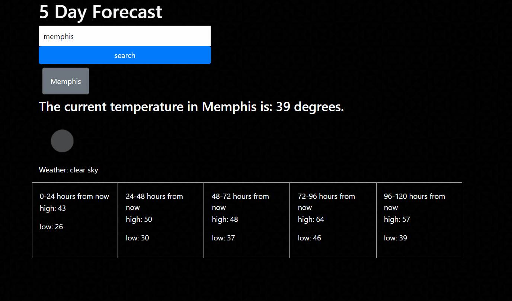

# Weather Dashboard

## Tools used:
1. HTML 
2. CSS
3. JavaScript/JQuery
4. MomentJS

## User Story: 
### As a delicated and fair person who is sensitive to the elements, I would like to: 
1. See the weather in whichever city I search.
2. See both the current weather, and the future forecast.
3. Easily select cities that I've searched in the past.

## View deployed app [HERE](https://nich-o-las.github.io/weatherDashboard/)
